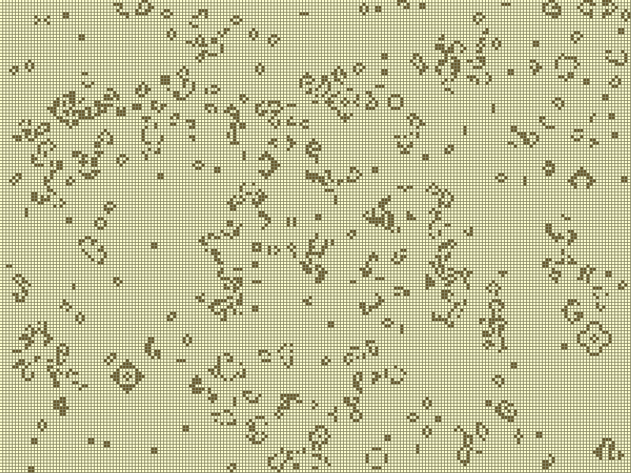

# life
Conway's game of life with sdl display

You can use the following keys when life runs:

    q     - Quits the program
    UP    - Speed up cycle
    DOWN  - Lower speed
    d     - Default speed
    r     - Restart the simulation
    SPACE - Pause

Everybody likes screenshots i guess

